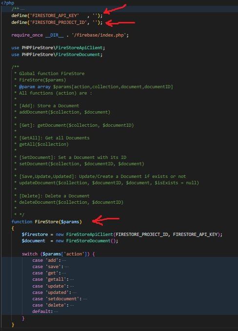

# Laravel 10 and Firebase

Class PHP to used Firebase with Laravel 10.

## Installation

Download and insert this class in your project.

```bash
require 'Firebase.php';
```

## Usage

```python
require 'firebase/index.php';

The main function named FireStore($params). $params is an array contains four parameters: $params[action,collection,document,documentID].
$action is : 'add', 'get', 'getAll', 'SetDocument', 'delete', 'save', 'update' or 'updated'.

# To store data
$collection = '';
$data   = array();
$params = ['action'=>'add','collection'=>$collection,'document'=>$data]
FireStore($params);

# Get/Read all data
$collection = '';
$params = ['action'=>'getAll','collection'=>$collection]
FireStore($params);

# Get/Read specific data by ID
$collection = '';
$documentID = '';
$params = ['action'=>'get','collection'=>$collection,'documentID'=>$documentID]
FireStore($params);

# Simple Update specific document by ID
$collection = '';
$documentID = '';
$data   = array();
$params = ['action'=>'updated','collection'=>$collection,'document'=>$data,'documentID'=>$documentID]
FireStore($params);

# Delete specific document by ID
$collection = '';
$documentID = '';
$params = ['action'=>'delete','collection'=>$collection,'documentID'=>$documentID]
FireStore($params);

 
```
## Pictures




